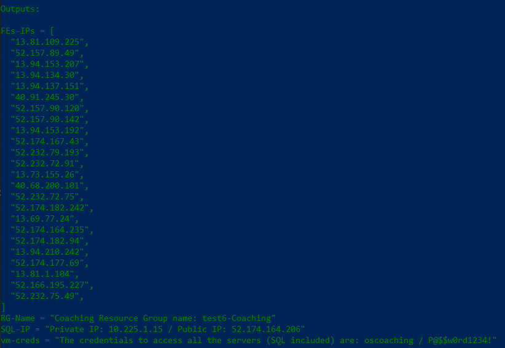
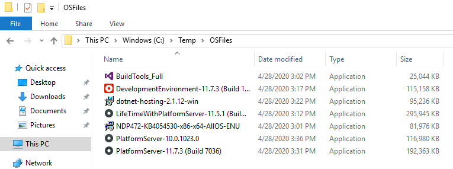

# OutSystems Ops Coaching Infrastructure Provisioning in Azure

The infrastructure created is composed of:
* 1 Resource Group 
* 1 Vnet 
* 1 Subnet 
* 1 SQL Server (IaaS)
* Multiple VMs based on the amount of people involved in the coaching (It will create 3 VMs for each person)

# Instructions on how to use these artifacts
## Through Command Line\Console
### Setup Terraform and Azure CLI (first time only)

If first time running a Terraform template, please do the following:

* Install Azure CLI for [Windows](https://docs.microsoft.com/en-us/cli/azure/install-azure-cli-windows?view=azure-cli-latest&tabs=azure-cli), [Mac OS](https://docs.microsoft.com/en-us/cli/azure/install-azure-cli-macos?view=azure-cli-latest) or [Linux](https://docs.microsoft.com/en-us/cli/azure/install-azure-cli?view=azure-cli-latest) (It can take around 5 minutes to complete).
* Once Azure CLI is installed, from PowerShell / Bash run `az login` to ensure the installation of Azure CLI is completed and you’re able to connect to our Azure subscription. You will need to login to Azure with your AD credentials (Example: joao.amaral@outsystems.com / secretpassword).

* Download [version 1.1.4 of Terraform](https://releases.hashicorp.com/terraform/1.1.4/) and make sure you update the path environment variable
    Example steps for Windows:
    1. Go to [Terraform 0.14 Download link](https://releases.hashicorp.com/terraform/1.1.4/).
    2. Download the applicable package to your local system.
    3. Extract the package to the folder `C:\Program Files (x64)`. This path is used as an example. However, you can also the Terraform executable to any other location in your local system.
    4. Update the path environment variable to include the folder where your Terraform executable is located.
        * Go to the __Control Panel__.
        * Click __System__.
        * On a Windows 10 system, click __Advanced system settings__.
        * Click __Environment Variables__ near the bottom of the window.
        * In the System variables pane, click __Path__ and then click __Edit__.
        * Click __New__. Add the path to the folder where your Terraform executable is located.
        * Click __OK__ to save your changes and then click __OK__ to exit the Environment Variables windows. Then click __OK__ again to exit the System Properties window.

* To verify your Terraform installation and check the version, launch PowerShell / Bash and run: `terraform -version`

### Provision the infrastructure

If you already installed Terraform and Azure CLI, then you can proceed with the provisioning of the resources in Azure.

1. Download/clone this repo.
2. Within PowerShell / Bash change directory to where you downloaded the Terraform Script on Step 1
3. Run `terraform init`
4. Run `terraform apply` and fill out the requested fields
5. Enter `yes` to confirm the provisioning of the resources

Terraform takes around 10-15 minutes to provision the resources. Once it finishes provisioning the resources, an output is presented within PowerShell / Bash with all relevant information.

### VMs considerations

* VMs are consisted of a dual-core CPU, 8 GB of RAM and a separate drive to install the platform
* OutSystems installation files are located under C:\Temp\OSFiles

* Windows Firewall needs to be properly configured to ensure communication across VMs
